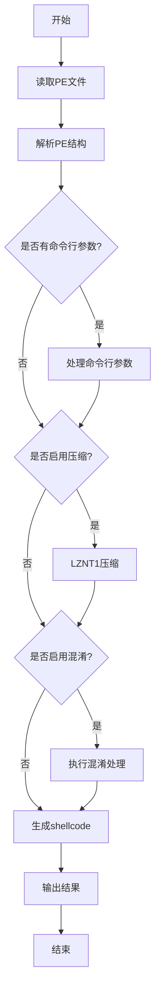

# Clematis


[ [中文](https://github.com/CBLabresearch/clematis/blob/main/readme_ch.md) | [English](https://github.com/CBLabresearch/clematis/blob/main/readme.md) ]

🛠️ 一个强大的工具，用于将PE文件（EXE/DLL）转换为与位置无关的shellcode。

## ✨ 主要特性

- 支持将PE文件（EXE/DLL）转换为shellcode
- 同时兼容x86和x64架构
- 支持命令行参数
- 内置LZNT1压缩算法，显著减小输出文件大小
- 可选的混淆功能，增强隐蔽性

## 📦 安装

### 依赖项
```bash
pip install pefile lznt1
```

## 🚀 使用方法

```bash
python clematis.py -f <PE文件> -o <输出文件> [-g <true/false>] [-c <true/false>] [-p <参数>]
```

### 参数说明

|  |  | 描述 | 默认值 | 是否必需 |
|--|--|------|---------|---------|
| **-f** | **--file** | 需要转换的PE文件路径 | | 是 |
| **-o** | **--output** | 输出文件名 | | 是 |
| **-g** | **--garble** | 启用混淆 | true | 否 |
| **-c** | **--compress** | 启用压缩 | true | 否 |
| **-p** | **--parameter** | 传递给PE文件的执行参数 | | 否 |

### 使用示例

```bash
# 显示帮助信息
python clematis.py -h

# 基本用法
python clematis.py -f target.exe -o output.bin

# 禁用混淆和压缩
python clematis.py -f target.exe -o output.bin -g false -c false

# 传递参数给目标程序
python clematis.py -f target.exe -o output.bin -p arg1 arg2

python clematis.py -f target.exe -o output.bin -p "arg1 arg2"
```

## 💪 我们的优势

- 🎯 支持 DOT NET
- 🗜️ 支持压缩
- 🎭 支持混淆
- 🔄 支持参数传递
- 🚀 对golang进行完全的支持
- 💪 构造的shellcode非常的强大且稳定

## 💡 设计理念

##### 在某些特殊环境中，我们可能会遇到以下挑战：

```text
- 🛡️ 无法进行进程注入（AV/EDR/XDR拦截）
- 🔄 当前进程中执行golang程序可能导致阻塞
- 💾 golang程序执行后可能存在内存泄漏
- ⚠️ golang创建的线程无法释放！
```

##### 为解决这些问题，我们开发了clematis：

```
- ✨ 将golang程序转换为shellcode
- 🎯 在当前进程中直接执行
- ♻️ 执行完毕后自动释放内存
- 🚀 完全避免golang相关的内存问题
- 🔄 回收golang创建的所有线程
```

## 📝 注意事项

- 确保有足够的权限读取源PE文件和写入目标文件
- 转换大文件时建议启用压缩功能
- 混淆可能会增加一些性能开销，但能提供更好的隐蔽性

## ⚠️ 已知问题

- 使用mingw | gcc编译的应用程序（exe）的部分内容可能无法加载，这可能是由重定位导致的？（未实现）
- DOT NET 出现非法内存访问（已修复）

## 🗓️ 计划功能

- 更高级的加密选项以提升安全性
- 图形界面支持，便于操作
- 实时转换进度监控
- 处理PE中的资源
- 增加规避能力，比如 [ProxyDll, Syscall, ...]

## 🔄 最近更新

- 2024-12-27
    - 支持 DOT NET（x64 | x86）

- 2024-12-28
    - 修复了潜在的 DOT NET 程序崩溃问题（可能不会发生）
    - 添加了 IMAGE_DIRECTORY_ENTRY_EXCEPTION 的处理（x64）
    - 更新API使用NTAPI

        | 原API | 新API |
        | --- | --- |
        | `VirtualAlloc` | `NtAllocateVirtualMemory` |
        | `VirtualProtect` | `NtProtectVirtualMemory` |
        | `VirtualFree` | `NtFreeVirtualMemory` |
        | `LoadLibrary` | `LdrLoadDll` |
        | `GetProcAddress` | `LdrGetProcedureAddress` |
        | `WaitForMultipleObjects` | `NtWaitForMultipleObjects` |
        | `CreateEvent` | `NtCreateEvent` |
        | `CloseHandle` | `NtClose` |
        | `SignalObjectAndWait` | `NtSignalAndWaitForSingleObject` |
        | `TerminateThread` | `NtTerminateThread` |
        | `SuspendThread` | `NtSuspendThread` |
        | `OpenThread` | `NtOpenThread` |
        | `ResumeThread` | `NtResumeThread` |
        | `GetContextThread` | `NtGetContextThread` |
        | `SetContextThread` | `NtSetContextThread` |
        | ... |

- 2025-1-1
    - 增加了线程列表和内存列表管理的线程安全性
    - 修复了一些功能性问题
    - 移除了payload中的参数处理并改为patch方式
    - 支持upx
    - 在payload中添加架构检查以验证架构是否匹配
    - 更改了一些实现方式以提供更好的兼容性

---

## 🔍 工作原理

Clematis通过以下步骤将PE文件转换为shellcode：

1. 读取并解析目标PE文件
2. 处理命令行参数（如果有）
3. 可选的LZNT1压缩
4. 可选的混淆处理
5. 生成最终的位置无关shellcode



---

## 🤝 贡献

欢迎提交Issues和Pull Requests！
